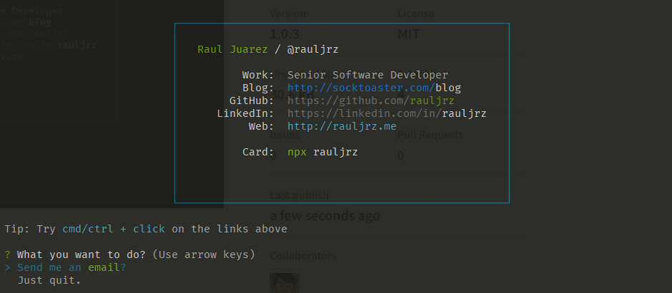

<h2>It's me, Raúl Juárez!</h2>
<p><em>Software Developer  
</em></p>


-----------

A little more about me... with npm installed, just type

```
npx rauljrz
```



**Skills:**  

<code></code>
<code></code>
<code></code>
<code></code>
<code></code>
<code></code>


